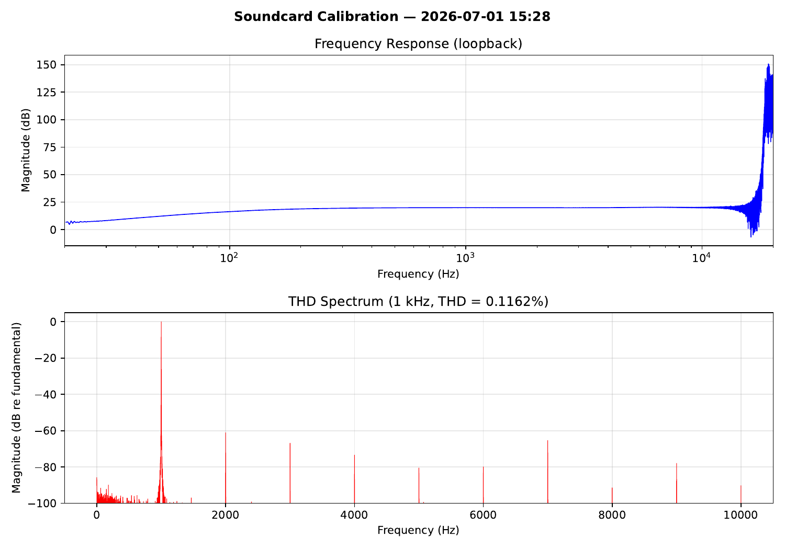

# soundcard-cal — Soundcard Self-Calibration

Characterizes the PC soundcard as a measurement instrument by running
automated loopback tests (output → input). Produces a calibration JSON
file that other soundcard projects can load to apply frequency response
correction, know their noise floor, and understand crosstalk limits.

## Example Calibration Report



**Example results (USB Audio Device loopback):**
- Noise floor: -73.9 dBFS
- Dynamic range: 73.9 dB  
- THD @ 1 kHz: 0.116% (-58.7 dB)
- Frequency response: 4.0 dB ripple (100 Hz–10 kHz), 20.1 dB mean gain
- Auto-detected loopback gain: 9.5× (amplitude adjusted to 0.052)

## What it measures

| Measurement | Method |
|-------------|--------|
| Noise floor (dBFS) | Record silence, compute RMS |
| Dynamic range (dB) | Full-scale – noise floor |
| Frequency response | Log-swept sine, cross-spectral H(f) = Y(f)/X(f) |
| THD (1 kHz) | Single-tone, Blackman-Harris window, harmonic search |
| Channel crosstalk | Tone on L only, measure leakage on R |

## Usage

```bash
# Loopback cable required: connect output to input
# Auto-detects loopback gain and saves to ~/.config/rf-bench/
python soundcard_cal.py

# Specify devices
python soundcard_cal.py --input-device 3 --output-device 3

# Generate PDF report
python soundcard_cal.py --input-device 3 --output-device 3 --pdf report.pdf

# Custom output file (overrides standard location)
python soundcard_cal.py --output my_soundcard.json

# Override amplitude (skip auto-detection)
python soundcard_cal.py --amplitude 0.05

# Test mode (no hardware, synthetic impairments)
python soundcard_cal.py --test --pdf test_report.pdf
```

## Auto-Detection

The script automatically detects loopback gain by sending a 1 kHz test tone and measuring the returned signal. It then calculates a safe amplitude (targeting 70% of full scale) to avoid clipping while maximizing SNR.

**Detection handles:**
- High-gain loopbacks (like USB soundcards with built-in gain)
- Unity-gain loopbacks (direct cable connections)
- Attenuated loopbacks (line-out → mic-in with attenuator)
- Disconnected loopback (aborts with error)
- Severe clipping (retries at lower level, aborts if still clipping)

**Override with `--amplitude` if:**
- You want to test at a specific level
- Auto-detection fails for some reason

## Standard Locations

**Calibration files:** `~/.config/rf-bench/soundcard_cal_<device_name>.json`  
**PDF reports:** Specify with `--pdf` flag (no default location)

Other soundcard projects automatically load calibration from `~/.config/rf-bench/`.

## Flags

- `--output FILE` — calibration JSON output (default: `~/.config/rf-bench/soundcard_cal_<device>.json`)
- `--pdf FILE` — generate calibration report PDF
- `--duration SECS` — test signal duration (default: 3.0)
- `--amplitude AMP` — test signal amplitude 0-1 (default: auto-detect)
- Standard audio device flags (`--input-device`, `--output-device`, etc.)
- `--test` — run with synthetic data (no soundcard needed)

## Output format

```json
{
  "timestamp": "2025-01-01T00:00:00+00:00",
  "samplerate": 48000,
  "noise_floor_dbfs": -96.2,
  "dynamic_range_db": 96.2,
  "thd_1khz_pct": 0.0032,
  "thd_1khz_db": -89.9,
  "crosstalk_db": -62.4,
  "freq_response": {
    "freqs_hz": [0, 33, 66, ...],
    "magnitude_db": [0.0, -0.1, -0.2, ...]
  }
}
```

## Using the calibration

Other projects can load the JSON and apply correction:

```python
import json, numpy as np

with open("soundcard_cal.json") as f:
    cal = json.load(f)

# Correction curve (inverse of measured response)
freqs = np.array(cal["freq_response"]["freqs_hz"])
mag = np.array(cal["freq_response"]["magnitude_db"])
correction_db = -mag  # invert to flatten
```

## What makes a good soundcard?

| Parameter | Typical onboard | Good external | Excellent |
|-----------|----------------|---------------|-----------|
| Noise floor | -80 dBFS | -96 dBFS | -110 dBFS |
| THD (1 kHz) | 0.01% | 0.001% | 0.0005% |
| Freq response | ±3 dB | ±0.5 dB | ±0.1 dB |
| Crosstalk | -50 dB | -70 dB | -90 dB |

## Requirements

- `numpy`, `scipy`, `matplotlib`
- `sounddevice` (for live mode)
- Loopback cable (3.5mm TRS M-M or equivalent)
