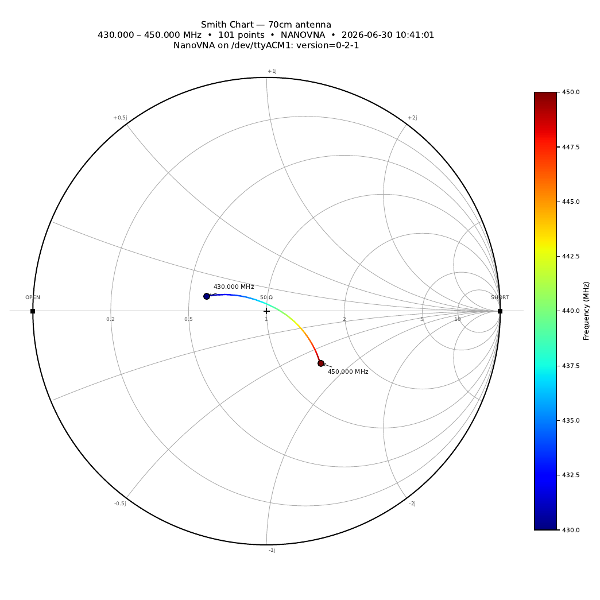

# smith-pdf — Antenna Smith-chart PDF

S11 sweep on VNA port 1 → Smith chart of Γ vs frequency → single-page PDF.

Companion to [`../swr-pdf/`](../swr-pdf/) — same swappable VNA API, same
defaults, just a different view of the same complex S11 trace.

Works with either of the swappable VNA drivers:

- `rf_bench.nanovna.NanoVNA` — **default**, USB CDC at `/dev/ttyACM1`
- `rf_bench.hp.HP8712B` — KISS-488 Ethernet-GPIB at `10.1.1.70`

## Setup

```
VNA Port 1 ──BNC / SMA──→ Antenna under test
```

For accurate results, run a SOLT (or OSL for one-port) calibration on the
NanoVNA across the same sweep range first and leave correction enabled.
Without calibration the trace includes the port connector mismatch.

## Usage

```bash
# 70cm HT antenna, NanoVNA on /dev/ttyACM1 (default)
python smith_pdf.py --start 430 --stop 450  --label "70cm antenna" --output 70cm_smith.pdf

# 23cm (1.2 GHz) antenna
python smith_pdf.py --start 1240 --stop 1300 --label "23cm antenna" --output 23cm_smith.pdf

# Full HF — 3 to 30 MHz
python smith_pdf.py --start 3 --stop 30 --label "HF antenna" --output hf_smith.pdf

# Optional flags:
#   --vna {nanovna,hp}    driver selection (default nanovna)
#   --port /dev/ttyACM1   NanoVNA serial path
#   --host 10.1.1.70      HP KISS-488 host
#   --points N            sweep points (NanoVNA max 401, HP max 801; default 401)
#   --average N           software-average N sweeps (works on both drivers)
#   --power DBM           HP source power; ignored on NanoVNA
```

## Output

Single-page PDF with:

- **Smith-chart grid** — unit circle, constant-R circles (0.2, 0.5, 1, 2, 5, 10),
  constant-X arcs (±0.2, ±0.5, ±1, ±2, ±5), real axis
- **Reference markers** — `+` at Z = 50 Ω (Γ = 0), squares at open and short
- **Γ locus** coloured blue → red across the sweep, with the **start** and
  **stop** points labelled with their frequencies
- **Frequency colour bar** alongside the chart
- Title with DUT label, sweep range, point count, driver, IDN, timestamp

## Example output

A real 70cm sweep against a dual-band HT antenna on a NanoVNA-F:



Full PDF: [70cm_smith.pdf](70cm_smith.pdf)

## Notes

- The NanoVNA hardware is forward-only (1.5-port). This script only uses
  S11, so the NanoVNA is fully capable here.
- `--power` is silently ignored when `--vna nanovna` is selected because
  the NanoVNA firmware exposes only a coarse `power 0..3` index that is
  not specified in dBm.
- A point at Γ = 0 (the chart centre) means a perfect match to Z₀ = 50 Ω.
  A locus that hugs the outer unit circle means near-total reflection
  (very high VSWR) — typically "wrong antenna for this band" or
  "calibration loaded for a different sweep range."
