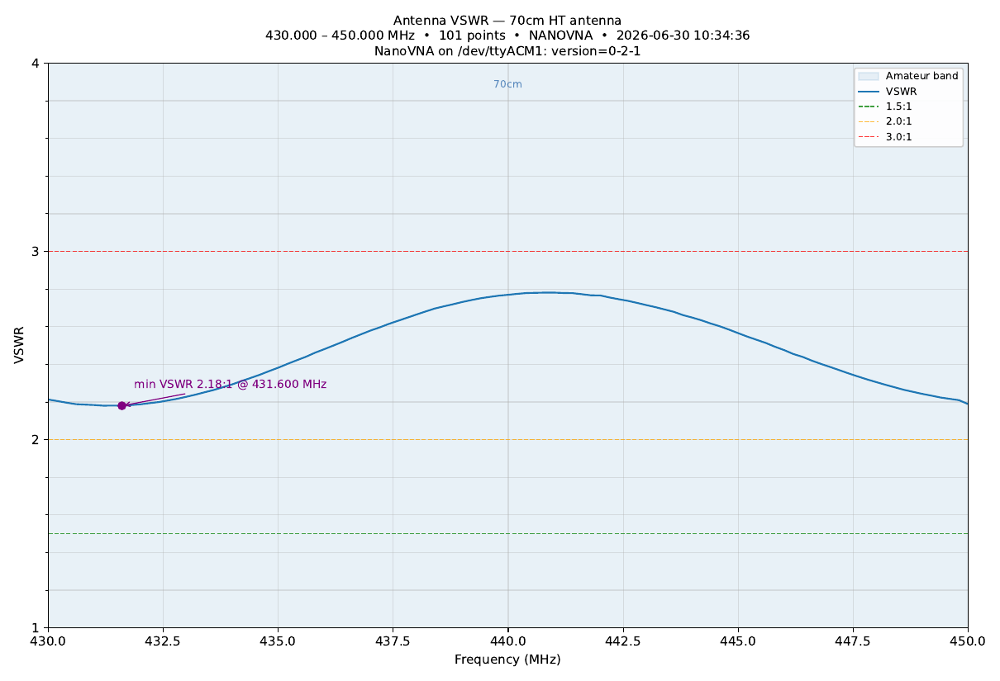

# swr-pdf — Antenna VSWR PDF Chart

S11 sweep on VNA port 1 → VSWR vs frequency → single-page PDF chart.

Works with either of the swappable VNA drivers:

- `rf_bench.nanovna.NanoVNA` — **default**, USB CDC at `/dev/ttyACM1`
- `rf_bench.hp.HP8712B` — KISS-488 Ethernet-GPIB at `10.1.1.70`

## Setup

```
VNA Port 1 ──BNC / SMA──→ Antenna under test
```

For accurate results, run a SOLT (or OSL for one-port) calibration on the
NanoVNA across the same sweep range first and leave correction enabled.
Without calibration the result includes the port connector mismatch.

## Usage

```bash
# 2m HT antenna, NanoVNA on /dev/ttyACM1 (default)
python swr_pdf.py --start 144 --stop 148  --label "2m HT antenna" --output 2m.pdf

# 70cm HT antenna
python swr_pdf.py --start 430 --stop 450  --label "70cm HT antenna" --output 70cm.pdf

# Full HF — 3 to 30 MHz
python swr_pdf.py --start 3 --stop 30 --label "HF antenna" --output hf.pdf

# Optional flags:
#   --vna {nanovna,hp}    driver selection (default nanovna)
#   --port /dev/ttyACM1   NanoVNA serial path
#   --host 10.1.1.70      HP KISS-488 host
#   --points N            sweep points (NanoVNA max 401, HP max 801; default 401)
#   --average N           software-average N sweeps (works on both drivers)
#   --power DBM           HP source power; ignored on NanoVNA
```

## Output

Single-page PDF with:

- **VSWR vs frequency** on a linear axis with integer gridlines (the way hams read them). Y range auto-sizes to `ceil(max VSWR) + 1`, floored at 3 and capped at 10; anything past the top is clipped — the annotation always prints the true minimum.
- Reference lines at **1.5:1, 2:1, 3:1**
- **Min-VSWR marker** with the resonant frequency annotated
- **Amateur band shading** for any of 160 m – 70 cm covered by the sweep
- Title with antenna label, sweep range, point count, driver, IDN, timestamp

The script is intentionally simpler than `projects/vna/antenna/` — no Smith
chart, no R+X panel, no resonance-finding. Just a clean VSWR plot suitable
for sharing or logging.

## Example output

A real 70cm sweep against a dual-band HT antenna on a NanoVNA-F:



Full PDF: [70cm_ht.pdf](70cm_ht.pdf)

## Notes

- The NanoVNA hardware is forward-only (1.5-port). This script only uses
  S11, so the NanoVNA is fully capable here.
- `--power` is silently ignored when `--vna nanovna` is selected because
  the NanoVNA firmware exposes only a coarse `power 0..3` index that is
  not specified in dBm.
- Amateur band shading uses US ITU Region 2 allocations; close enough for
  visualization in IARU R1/R3 too.
